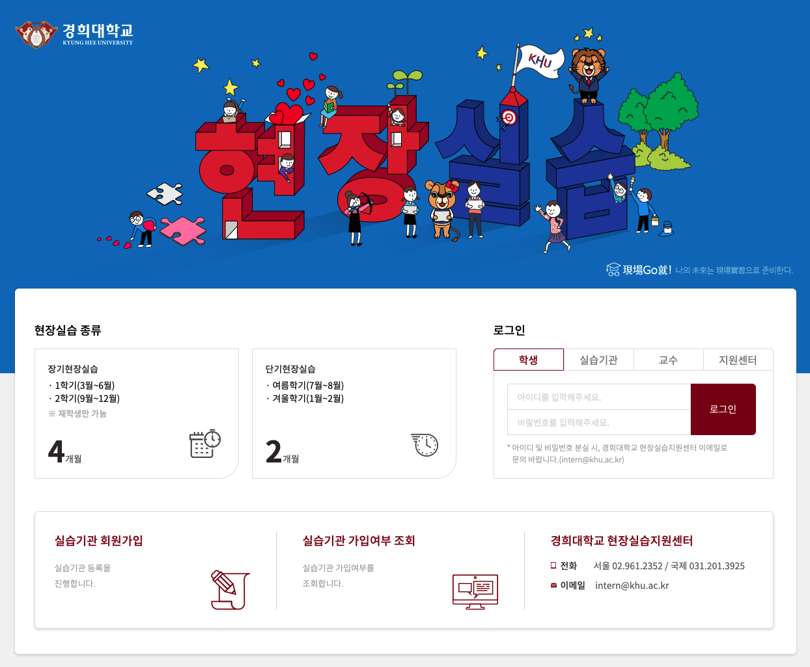
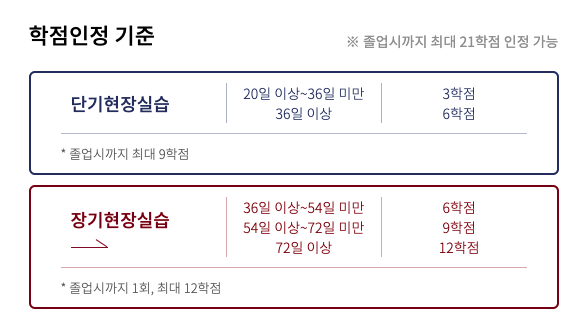

> 2020.06.29 - 2020.10.16 동안의 경험에 관한 글입니다.

&nbsp;

## 경희대학교 현장실습



모든 대학교가 그렇듯, 경희대학교에도 산학 현장실습 프로그램이 있다. 학기 중에 진행하는 장기 현장실습, 방학 중에 진행하는 단기 현장실습으로 나뉜다.



장기 현장실습의 경우, 한 학기에 학점으로 채울 수 있는 학점보다 낮았기 때문에 나는 단기 현장실습을 선택했다. 현장실습의 경우 3-1을 수료한 재학생만 신청 가능하기 때문에, 3학년 여름방학에 지원하게 되었다.

&nbsp;

## 첫 번째 서류, 첫 번째 면접, 첫 번째 인턴

서류 작성도 처음이었다. 작성할만한 내용이 없었기 때문에 프론트엔드 직군으로 지원했음에도, 해봤던 건 뭐든 죄다 적어 넣었다. 어설픈 서류였음에도 학교 현장실습이었기 때문에 무난하게 통과할 수 있었다.

이어서 면접을 진행했고, 칭찬이 가득한(?) 면접이었다. 학부생이 이런 것까지 해봤어요? 와 같은 맥락이었다. 지금 생각해보면 제대로 할 줄 아는 게 없던 꼬꼬마 시절이었지만, 그래도 열심히 뭔갈 많이 하긴 했었다.

그렇게 인생 첫 번째 인턴이 시작되었다. 3학년 여름방학 두 달 간의 40시간 풀타임 근무를 마치고도, 학교가 코로나로 인해 전면 온라인이 되었기에 파트타임으로 계속 일해보지 않겠냐는 제의를 받았다. 그렇게 이후 두 달 간은 주 20시간 파트타임으로 근무를 진행했다.

&nbsp;

## 트웬티온스, 그리고 첫 실무

[트웬티온스](https://twentyoz.kr/)는 웹서비스와 AR/VR 서비스를 다루는 SI 회사다. 당시 인턴으로 근무했을 때에 비해 회사가 많이 커졌다! 언제 한 번 다시 찾아가 인사드리고 싶다 :)

나는 LS Mtron 전주공장 FMS 구축 프로젝트에 투입되었다. 프로젝트는 Vue.js와 Spring으로 진행되었고, 나는 Vue를 사용하여 프론트엔드를 맡아 개발했다. 직원들이 사용하는 모바일용 웹앱과 어드민용 백오피스 웹을 함께 개발했다.

이제껏 혼자서, 또는 또래들과 함께 재미로만 서비스를 개발해왔는데 실제로 프로덕트를 개발하고 배포하는 경험은 너무 새롭고 놀라웠다.

아쉬운 점은 기술 스택이었다. 바닐라를 거쳐 리액트를 공부하던 중이었기 때문에, 실무에서 리액트를 쓰면 어떤 느낌일까?를 항상 궁금해 해 왔다. 하지만 회사는 뷰를 쓰고 있었고 나에겐 조금 아쉬운 점으로 다가올 수밖에 없었다.

하지만 돌이켜보면 다 좋은 경험이었다. 이때 뷰를 써보았기 때문에 후에 다른 회사에서 인턴을 진행했을 때에도 뷰를 사용할 수 있었다. (그리고 뷰랑 리액트가 그렇게 어마 무시한 차이 나는 것도 아니었다.)

또 이때 인턴을 하면서 제대로 써보기 시작한 게 많았다. 깃도 제대로 써보고, 이슈 티켓도 발행해서 태스크를 처리하고, 사내 메신저를 이용해서 커뮤니케이션하고... 사내 스터디도 진행했었다. 당시 인원이 적었기에, 대표님들을 중심으로 새로운 시도도 많이 했던 것 같다. 코틀린으로 디자인 패턴 스터디를 진행했는데, 오래 근무하지 않았기에 끝까지 참여를 하진 못했지만 너무 즐거운 경험이었다 :)

학부생으로선 정말 큰 경험을 쌓을 수 있었던 시간이었다. ~~비록 현장실습의 학점과 지원금은 너무나도 짰지만..~~ 그럼에도 불구하고 다시 그때로 돌아간다 하더라도 또 할 것 같다 :)

```toc
```